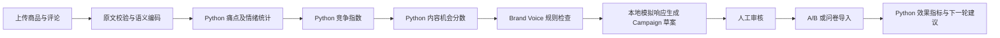

# Workflow 图

```mermaid
flowchart LR
  A[上传商品与评论] --> B[原文校验与语义编码]
  B --> C[Python 痛点及情绪统计]
  C --> D[Python 竞争指数]
  D --> E[Python 内容机会分数]
  E --> F[Brand Voice 规则检查]
  F --> G[本地模拟响应生成 Campaign 草案]
  G --> H[人工审核]
  H --> I[A/B 或问卷导入]
  I --> J[Python 效果指标与下一轮建议]
```

页面的 Campaign Workflow 当前使用项目内示例输入；上传数据的前四项分析在当前会话中运行。Workflow 各步骤输入、输出、状态、证据路径记录于 `outputs/runs/<运行编号>/`。本地模拟响应不代表外部模型分析；统计由 Python 模块完成。

